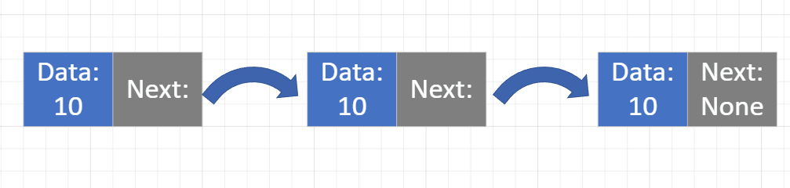

[Home](../README.md)

# Linked List Introduction
## Explaination
A linked list is a structure made up of nodes. Each node has a value and a pointer to the next node. The first node is called the head, and the last node is called the tail. The tail points to `None`. 

You can think of a linked list of like a scavenger hunt. The first clue is the head, and the last clue is the tail. The clues in between are the nodes and you cant get to the last clue without first going to all the clues in between.

This data structure is similar to an array, and is often represented similarly to an array. The biggest difference between a linked list and an array is that every position in an array can bee looked up with a time complexity of O(1). However, in a linked list, you have to traverse the entire list to get to the last node. This means that the time complexity of getting to the last node in a linked list is O(n).

**Previous Page:** [Queue Examples](../queues/examples.md)

**Current:** Linked List Introduction 

**Next Page:** [Linked List Time Complexity and Pros/Cons](./timeComplexityProsCons.md)
