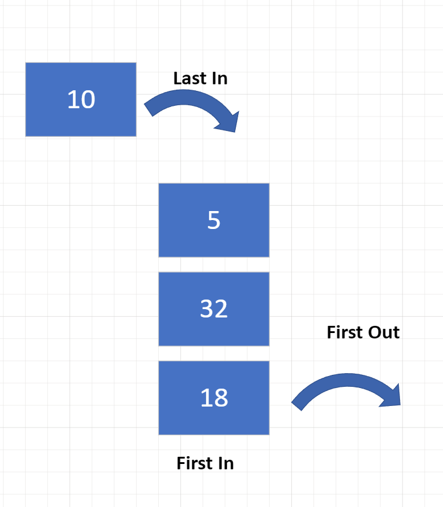

[Home](../README.md)

# Queue Introduction
## First in First out (FIFO)
The word `Queue` is synonomous with the word `line`. This makes understand how a Queue works very intuitive. FIFO, First in First out, the first person in the line, is the first person to get out of the line.

Notice in the image below, the First in is the First out, the Last in is not the first out.

This is the opposite of the data structure `Stack` which can be thought of with the acronym LIFO, or Last in First out. You can also think of a stack of paper.

**Previous Page:** [Home](../README.md)

**Current:** Queue Introduction 

**Next Page:** [Queue Time Complexity and Pros/Cons](./timeComplexityProsCons.md)
