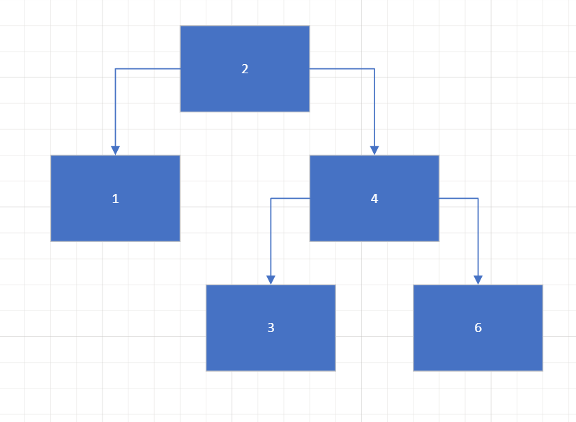
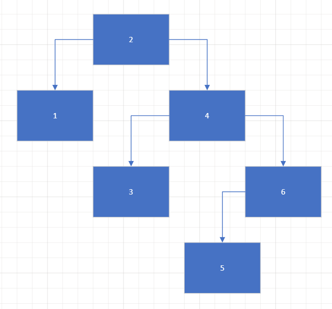
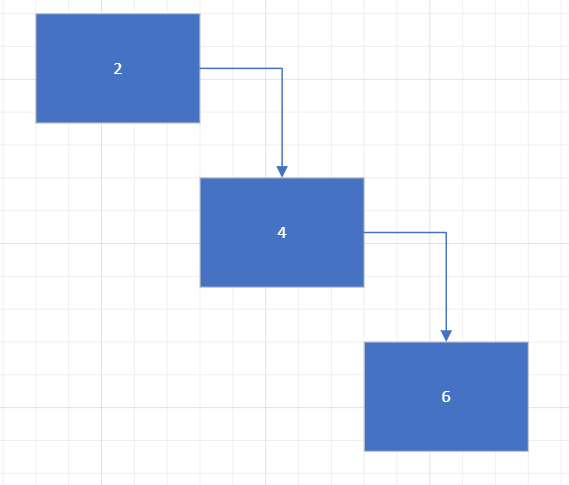
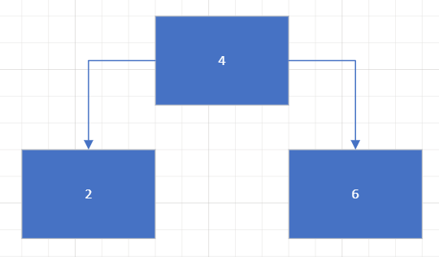

[Home](../README.md)

# Tree Introduction

## Explaination

A tree can be though of as like a tree, but usually represented upside down. In the example below, the root of the tree is at the top (2). The root has two child nodes, one to the left (1) and one to the right (4). The height of the tree is 3. You can find the height of a tree by finding the longest path down the entire tree and counting the nodes in the path. The tree has a total of 5 nodes.

A tree has similarities to a Linked List. A Linked List stores the 'head' and with the 'head' node, you can traverse the whole Linked List one node at a time. A tree is similar, but instead of having a 'head' node, you have a 'root' node. The root node is the top of the tree, and with the root node, you can traverse the whole tree one node at a time, but going down individual branches instead of the whole list.

## Adding to a Tree

In the tree above, if we were to add a number to the tree, for example 5, we would start at the root of the tree, 2. because 5 is greater than 2, we would go to the right child node of 2, 4. Because 5 is greater than 4, we would go to the right child node of 4, to 6. Because 5 is less than 6, we would go to the left child node of 6, because there is no node there, we would add 5 to the left child node of 6. This is shown below:

Adding to a tree this way can be very problematic. If we were to start with a root of 2, and just kept adding numbers increasingly bigger, we would very quickly have a very unbalanced tree. This is shown below:

To find out if a tree is balanced, the difference in heights between any two subtrees is at most 1. If the difference is greater than 1, the tree is unbalanced. The only balanced tree shown in the three images is the first tree. The second tree has two subtrees that have heights of 3 and 1, making it unbalanced.

## Balanced Trees

If we wanted to keep a tree balanced we can use a common implimentation called an AVL tree. An AVL tree is a self-balancing binary search tree. In an AVL tree, the heights of the two child subtrees of any node differ by at most one; if at any time they differ by more than one, rebalancing is done to restore this property. Lookup, insertion, and deletion all take O(log n) time. Insertions and deletions may require the tree to be rebalanced by one or more tree rotations.

An AVL tree will automatically balance trees whenever a node is added or deleted. This is done by rotating the tree. A rotated balanced tree of the previously shown tree is shown below.

**Previous Page:** [Linked List Examples](../linked_lists/examples.md)

**Current:** Tree Introduction

**Next Page:** [Tree Time Complexity and Pros/Cons](./timeComplexityProsCons.md)
